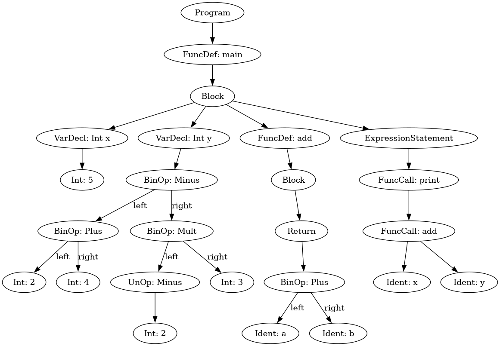

# Englang Compiler

A simple compiler for the `englang` language, written in Rust. It currently includes a lexer and a parser that builds an Abstract Syntax Tree (AST) from the source code.

## Sample Syntax

Here is a small example of `englang` syntax:

```eng
fn main() -> void {
  int x = 5;
  int y = 2 + 4 - (-2 * 3);

  fn add(int a, int b) -> int {
    return a + b;
  }

  print(add(x,y));
}
```

## How to Run

1.  Make sure you have Rust and Cargo installed.
2.  Clone the repository.
3.  Create a file with `.eng` extension (e.g., `test.eng`) and write your code in it.
4.  Run the compiler with the following command:

```bash
cargo run -- test.eng
```

## Visualizing the AST

To visualize the generated AST, you'll need to have Graphviz installed. You can find installation instructions on the official [Graphviz website](https://graphviz.org).

### Generating the image

Once Graphviz is installed, you can generate a PNG image from the `ast.dot` file with the following command:

```bash
dot -Tpng ast.dot -o ast.png
```

### Sample AST




This is the generated AST from this sample code.
```eng
fn main() -> void {
  int x = 5;
  int y = 2 + 4 - (-2 * 3);

  fn add(int a, int b) -> int {
    return a + b;
  }

  print(add(x,y));
}
```
